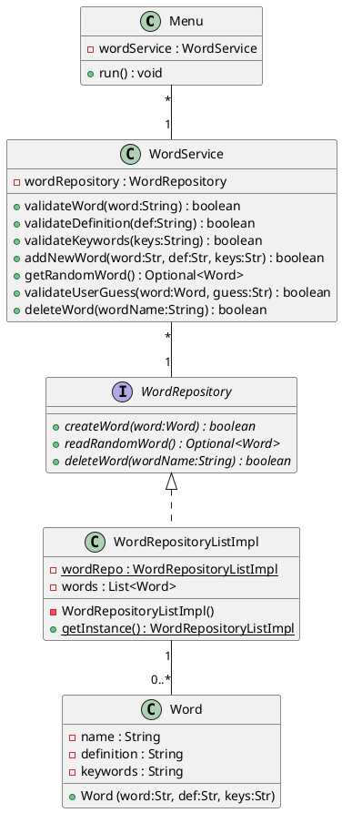

# Class diagram

```plantuml
@startuml

class Menu {
    - wordService : WordService
    + run() : void
}

class WordService {
    - wordRepository : WordRepository
    +validateWord(word:String) : boolean
    +validateDefinition(def:String) : boolean
    +validateKeywords(keys:String) : boolean
    +addNewWord(word:Str, def:Str, keys:Str) : boolean
    +getRandomWord() : Optional<Word>
    +validateUserGuess(word:Word, guess:Str) : boolean
    +deleteWord(wordName:String) : boolean

}

class Word {
    - name : String
    - definition : String
    - keywords : String
    + Word (word:Str, def:Str, keys:Str)
}

interface WordRepository{
    + {abstract} createWord(word:Word) : boolean
    + {abstract} readRandomWord() : Optional<Word>
    + {abstract} deleteWord(wordName:String) : boolean
}

class WordRepositoryListImpl implements WordRepository{
    - {static} wordRepo : WordRepositoryListImpl
    - words : List<Word>
    - WordRepositoryListImpl()
    + {static} getInstance() : WordRepositoryListImpl
}


WordService "*" -- "1" WordRepository
Menu "*" -- "1" WordService
WordRepositoryListImpl "1" -- "0..*" Word


@enduml
```