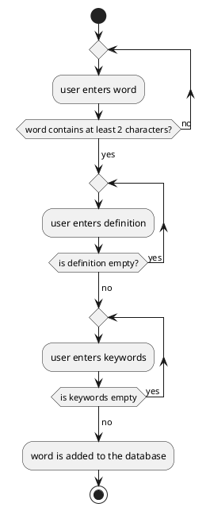
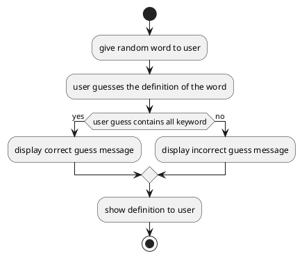
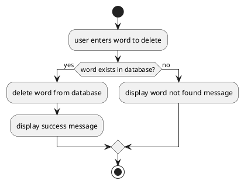

# Flowchart diagrams

## add word

```plantuml 
@startuml
start

repeat
:user enters word;
repeat while (word contains at least 2 characters?) is (no)
->yes;
repeat
:user enters definition;
repeat while (is definition empty?) is (yes)
->no;
repeat
:user enters keywords;
repeat while (is keywords empty) is (yes)
->no;

:word is added to the database;

stop
@enduml
```

## guess word 

```plantuml 
@startuml
start

:give random word to user;
:user guesses the definition of the word;
if (user guess contains all keyword) then (yes)
    :display correct guess message;
else (no)
    :display incorrect guess message;
endif

:show definition to user;

stop
@enduml
```

## delete word

```plantuml 
@startuml
start

:user enters word to delete;
if (word exists in database?) then (yes)
    :delete word from database;
    :display success message;
else (no)
    :display word not found message;
endif

stop
@enduml
```