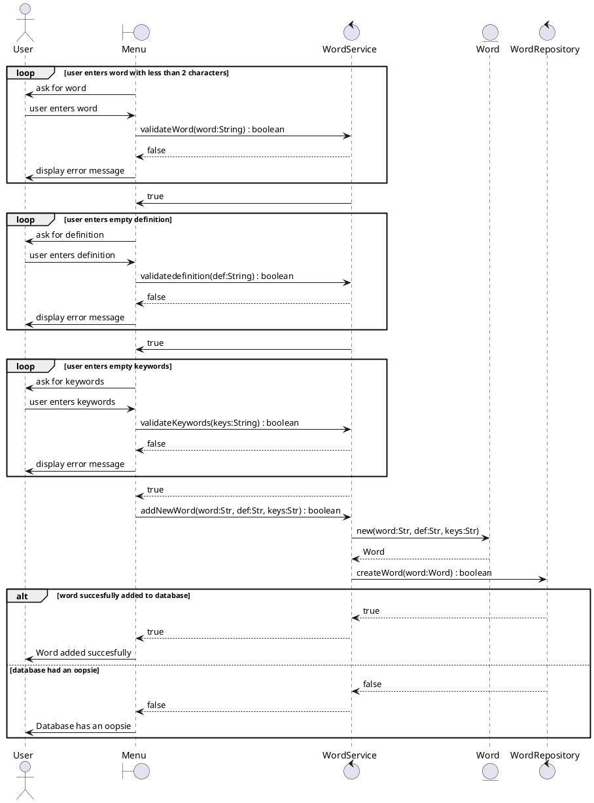
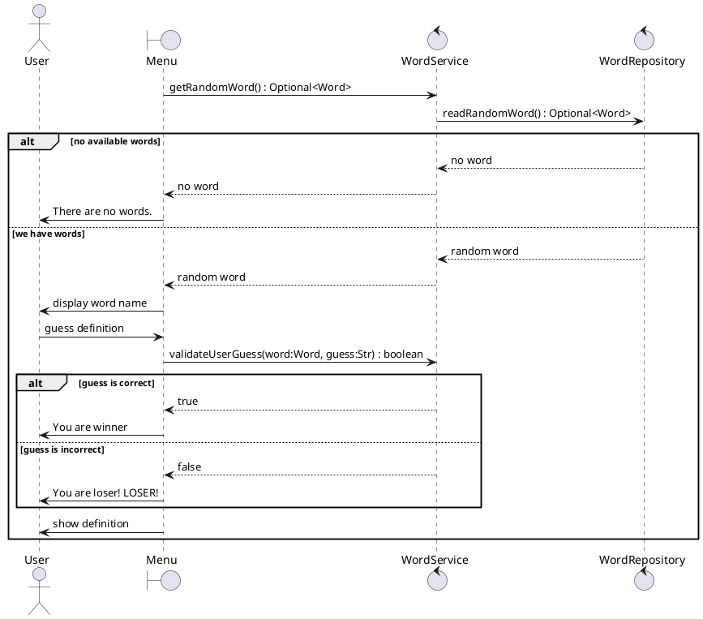
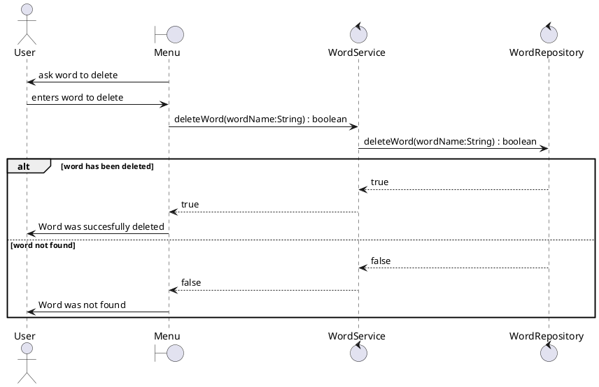

# Sequence Diagrams

## add word

```plantuml 
@startuml
Actor User as user
Boundary Menu as menu
Control WordService as wordservice
Entity Word as word
Control WordRepository as wordrepository


loop user enters word with less than 2 characters
menu -> user : ask for word
user -> menu : user enters word
menu -> wordservice : validateWord(word:String) : boolean
wordservice --> menu : false
menu -> user : display error message
end

wordservice -> menu : true

loop user enters empty definition
menu -> user : ask for definition
user -> menu : user enters definition
menu -> wordservice : validatedefinition(def:String) : boolean
wordservice --> menu : false
menu -> user : display error message
end

wordservice -> menu : true

loop user enters empty keywords
menu -> user : ask for keywords
user -> menu : user enters keywords
menu -> wordservice : validateKeywords(keys:String) : boolean
wordservice --> menu : false
menu -> user : display error message
end

wordservice --> menu : true

menu -> wordservice : addNewWord(word:Str, def:Str, keys:Str) : boolean
wordservice -> word : new(word:Str, def:Str, keys:Str)
word --> wordservice : Word
wordservice -> wordrepository : createWord(word:Word) : boolean

alt word succesfully added to database 
wordrepository --> wordservice : true
wordservice --> menu : true
menu -> user : Word added succesfully

else database had an oopsie
wordrepository --> wordservice : false
wordservice --> menu : false
menu -> user : Database has an oopsie
end

@enduml
```

## guess word 

```plantuml 
@startuml
Actor User as user
Boundary Menu as menu
Control WordService as wordservice
Control WordRepository as wordrepository

menu -> wordservice : getRandomWord() : Optional<Word>
wordservice -> wordrepository : readRandomWord() : Optional<Word>

alt no available words 
wordrepository --> wordservice : no word
wordservice --> menu : no word
menu -> user : There are no words.

else we have words
wordrepository --> wordservice : random word
wordservice --> menu : random word
menu -> user : display word name
user -> menu : guess definition
menu -> wordservice : validateUserGuess(word:Word, guess:Str) : boolean

    alt guess is correct
    wordservice --> menu : true
    menu -> user : You are winner

    else guess is incorrect
    wordservice --> menu : false
    menu -> user : You are loser! LOSER!

    end

menu -> user : show definition

end

@enduml
```

## delete word

```plantuml 
@startuml
Actor User as user
Boundary Menu as menu
Control WordService as wordservice
Control WordRepository as wordrepository

menu -> user : ask word to delete
user -> menu : enters word to delete
menu -> wordservice : deleteWord(wordName:String) : boolean
wordservice -> wordrepository : deleteWord(wordName:String) : boolean

alt word has been deleted
wordrepository --> wordservice : true
wordservice --> menu : true
menu -> user : Word was succesfully deleted

else word not found
wordrepository --> wordservice : false
wordservice --> menu : false
menu -> user : Word was not found

end

@enduml
```